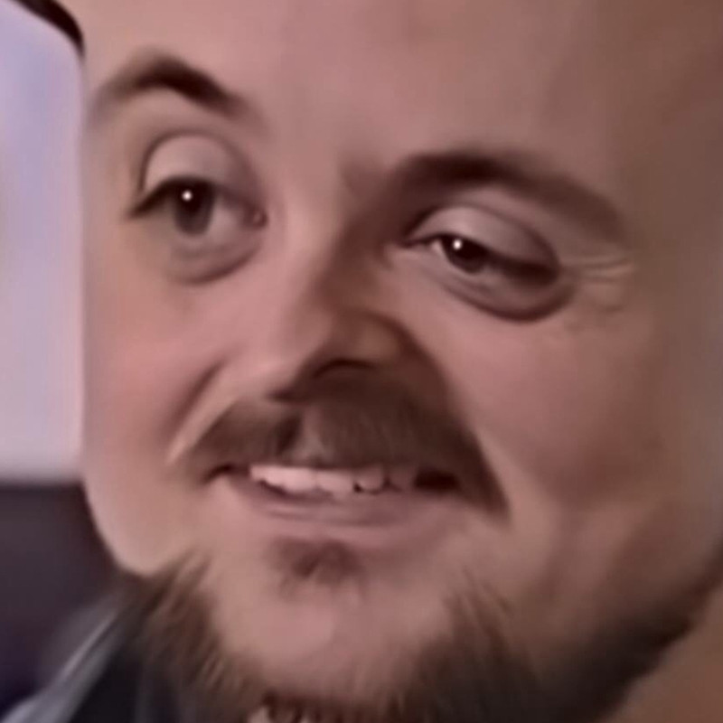

<h1 align="center">BotMan Studio</h1>

## About BotMan Studio

While BotMan itself is framework agnostic, BotMan is also available as a bundle with the great [Laravel](https://laravel.com) PHP framework. This bundled version is called BotMan Studio and makes your chatbot development experience even better. By providing testing tools, an out of the box web driver implementation and additional tools like an enhanced CLI with driver installation, class generation and configuration support, it speeds up the development significantly.

## Documentation

You can find the BotMan and BotMan Studio documentation at [http://botman.io](http://botman.io).

## License

BotMan is free software distributed under the terms of the MIT license.

## Localhost Guide

Prerequisites:
XAMPP or similar installed
Mysql module of XAMPP installed
Apache module of XAMPP installed
PHP version at least 7.0
Composer installed
Laravel installed

Unpack and place the EagleMediaChatbot folder in the XAMPP htdocs folder. 
Initialize the local environment, by starting the Apache server, as well as the Mysql server. 
Open the terminal at the project root, and run the commands "composer install", "npm install" and "php artisan serve". 
Make a note of the port it is being served on. 
Then enter the phpMyadmin, and import the dbdump.sql file. It is located in the root of the project. 
After this is done, the program is ready to be tested locally. 
Enter the frontpage by navigating to "http://localhost:<port>/botman/tinker". 
The local testing can be started by writing "start" in the chat window.
